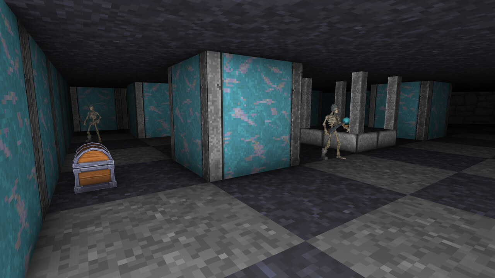
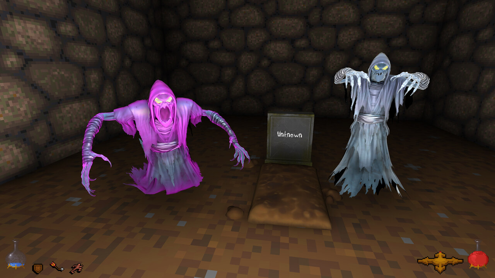
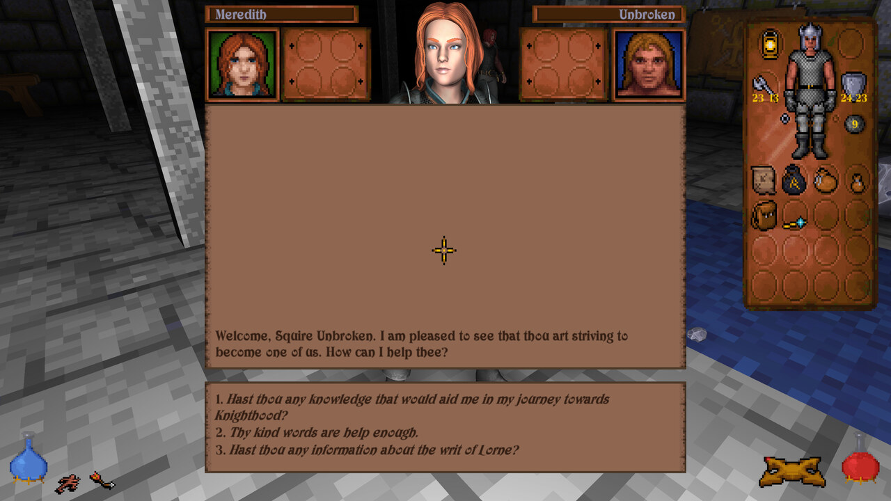

# Unity Underground

This project is a wrapper for the well-known 1992 dungeon crawler by Blue Sky Productions and Origin Systems: fully playable from start to finish, with a modern look, gamepad or mouse-and-keyboard controls, and 3D models for the objects and creatures.

## What's new

**Looks and sound**

  - 3D models for critters and objects
  - better lighting and particles
  - full audio

**Modern conveniences**

  - gamepad support, and mouse and keyboard
  - autosave at the beginning of each Abyss level and five quicksave slots, rolling in BG3 style
  - achievements
  - sprinting, bound to the Acrobat skill. Be warned: dashing through the level can make you miss secret details
  - four ratings on the inventory panel: attack and damage by the weapon hand, defence and armour by the shield hand
  - clearer attack feedback: the charge cursor stays dark until a release would actually land a swing, then lights up and fills
  - every few seconds the Search skill looks for you, and points out possible secrets and trapped objects in front of you

**Faithful to the original**

Every change is listed in the [CHANGELOG](CHANGELOG.md).

## Download and play

Get the latest build from the [itch.io page](https://kweepa.itch.io/unity-underground). It runs on Windows, and on Linux or a Steam Deck through Proton.

**You need the original game's data files**: the `game.gog` file of a GoG copy, or the `CRIT`, `CUTS`, `DATA` and `SOUND` folders of an installed original copy. GoG is the version it is tested with; the original DOS version should work too. The game looks for them in the usual places, and if it does not find them you can point it to the folder. If your copy is the ISO version (`game.gog`), the game extracts the data into a `LooseData` folder next to your saves (in AppData\LocalLow on Windows), not into the GOG install.

You can play with a gamepad or with mouse and keyboard, and the game switches between them as you use them. Every control is listed in [CONTROLS.md](CONTROLS.md).

Your saves are in `%USERPROFILE%\AppData\LocalLow\Kweepa\UnityUnderground\Saves`.

## Linux and Steam Deck

The Windows build runs through Proton or Wine. It usually runs well; if the frame rate drops badly, add `PROTON_USE_WINED3D=1` to the launch options - in Steam, `PROTON_USE_WINED3D=1 %command%`.

## Bugs and comments

**Bug reports and comments are both very welcome.** A bug is easiest to act on as a GitHub issue, where it can be tracked and closed, and a saved game attached to it helps a lot: one made just before the bug happens, and where the bug leaves a mark on the game, one made after it as well. For anything else - thoughts, questions, or something you would like to see - the [itch.io page](https://kweepa.itch.io/unity-underground) is the friendlier place, and it is where most of the conversation happens anyway.

## For developers

To sync from github, you will need to have git LFS (large file storage) installed, since the character textures are stored in LFS. If you are using GitHub desktop it should be installed already automatically.

The game is built with Unity 6000.0.68f1. The root scene is GameDirectoryDialog. Once you have run that scene once you can skip to using World.

I removed a number of store-bought assets before pushing this to github, so it may not work out of the box. Some things I removed were: some audio (a lot of interface clicks); some particles (water splashes mostly I think); and some minor textures and models. I think it should still run, but it might sound sparse and show some pink textures until those are replaced.

If you would like to contribute, [CONTRIBUTING.md](CONTRIBUTING.md) explains how.
